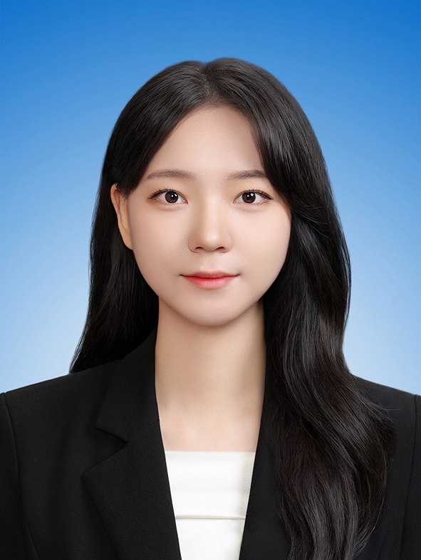

### 김현서 (KIM HYEONSEO)

> **"[재미 빼면 시체]"**

| 항목 | 정보 |
| :---: | :--- |
| **본명** | 김현서(金賢諝)[1] |
| **출생** | 2001년 05월 25일 (OO세) 대한민국 부산광역시 |
| **거주지** | 부산광역a시 |
| **학력** | 부산대학교 디자인학과 디자인앤테크놀로지전공 (학사/졸업) [2] |
| **신체** | 172cm, O형 |
| **가족관계** | 아버지, 어머니, 오빠, 언니[3] |
| **MBTI** | INTJ |
| **주요 스킬** |  Photoshop, Illustrator, Premier pro, Google Antigravity |
| **이메일** |  georia0525@naver.com |
| **기타(Mobile)** |  010.2269.5382 |

---
**[각주]**
[1] 아버지가 이름을 지을 당시, 드라마 '가을동화'의 여주인공 '은서'에서 아이디어를 얻었고, 언니와 돌림자인 '현'을 합쳐 '현서'가 되었다고 한다.
[2] 2026학년도부터 예술대학 디자인학과 소속에서 정보의생명공학대학 정보컴퓨터공학부 세부전공으로 변경되었다.
[3] 4살 터울이다.

## 2. 개요

김현서는 AI랑 한시도 떨어지지 않고 붙어있는 취업준비생이다. 

주로 Gemini Pro나 Google Antigravity 을(를) 못살게 굴며, 본인의 호기심을 해결하고 구현하는 작업을 한다. 스스로의 영감이나 창의력이 많은 사람들에게 재미를 제공하는 것을 목표로 하고 있다. ~~여전히 자신보다 웃긴 사람을 본 적이 없다고 한다~~

## 3. 특징 및 업무 스타일

* **[특징 1:  집요한 문제 이해 능력]**
  본인이 납득할 때 까지 문제를 이해하고 정의하는 편이다.
* **[특징 2: 더 나은 방향을 끊임없이 고민하는 리더십]**
 팀 프로젝트나 협업 시 해관계를 파악하고 팀의 궁극적인 목표를 달성하기 위해 더 나은 방식을 끊임없이 고민하는 스타일이다.

## 4. 상세 스킬 (Tech Stack)

* **언어 & 프레임워크**: C, Python, Java
* **도구 & 툴**: Git, Figma, Notion 
* **기타**: 컴퓨터활용능력 2급, OPIc IH 

## 5. 활동 및 프로젝트

### 5.1. Hommage(2023.01 - 2023.11
* **한 줄 소개**: 제14회 부산대학교 디자인앤테크놀로지전공 졸업전시회인터랙티브 미디어 전시 운영
* **담당 역할**: 전시 운영 총괄팀장
* **성과 및 배운 점**: 협력 업체와 커뮤니케이션 스킬 획득, 스케줄 관리 능력

### 5.2. Streamline Workflow by Ms Power Platform(2022.08.19 - 2022.08.21)
* **한 줄 소개**: 협업 자동화를 위한 서비스 개발 프로젝트(해커톤) 참여
* **담당 역할**: 서비스 기획 / 서비스 UI 제작 / 발표 자료 제작
* **성과 및 배운 점**: 마이크로소프트 트랙 1위 수상

## 6. 여담 (TMI)

* 키가 꽤 큰 편이다. 초등학교 5학년 때 친구가 같이 농구학원을 다니자고 꼬셔서 다녔다가 2년 간 초등부로 활약했다고 한다.
* 학창시절 조던.B.피터슨의 '12가지 인생의 법칙'을 읽으며 대학입시에 대한 멘탈을 단련했다고 한다. 대학에 가서는 빅토르 프랑클의 '죽음의 수용소'를 읽고 슬럼프를 이겨내는 데 도움을 많이 받았다고 한다. 
* 유튜브 채널 중 '보다(BODA)'를 가장 좋아한다. 과학이랑 역사에 대한 지식을 배우는 걸 좋아하기 때문에 영상을 보면 뇌가 똑똑해지는 기분이 든다고 한다.
* 오버워치를 즐겨한다. 주 챔피언은 솜브라. 하지만 애쉬를 잘하고 싶어 항상 애쉬를 픽하다가 게임이 질 것 같으면 솜브라로 바꾸는 편이다.

## 7. 어록

* "여기서 멈추지 마십시오."
* "예술가여, 무엇이 두려운가!"